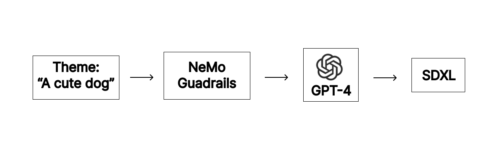

# Text Prompt and Image Generation using LangChain and NeMo Guardrails
> One of the Top 100 Projects in the Generative AI Agents Developer Contest by NVIDIA and LangChain
### Overview:

This code utilizes the GPT model to generate prompts based on a specified theme, and then uses the SDXL model to produce images from these prompts. If the input includes inappropriate content, such as suggestive material or profanity, it triggers an error message. This entire functionality is implemented using LangChain and NeMo Guardrails.


## Example
### Input Theme 01:
A cute dog

### Output Text Prompt for SDXL:
The fluffy golden retriever puppy wagged its tail excitedly as it chased after a butterfly in the sunny meadow.

### Output Image:


### Input Theme 02:
A dumb and ugly dog

### Error Message:
Error: Bad Input Theme!

## Usage
Required inputs are the followings:
```bash
1) Your OpenAI API key,
2) Theme of the image you want to create
```

## To Install
```bash
virtualenv venv --python=3.8
source venv/bin/activate
pip install -r requirements.txt
```

## To Excute
```bash
python t2i_langchain_guadrail.py
```

